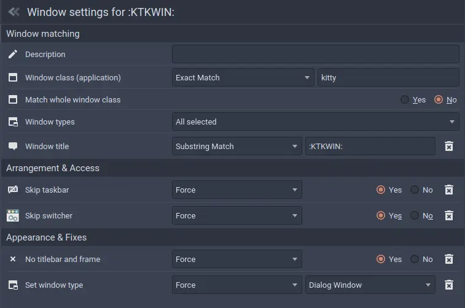

# KWin Kitty toggler
KWin script to handle toggle visibility of Kitty window wih `F12`.

# Install
The script will bind to `F12` by default.

A few ways to install:
 * Download and install the latest archive from this repo and install from the KWin Scripts settings module in KDE.
 * Symlink this directory to ~/.local/share/kwin/scripts

# Configure
When you add KWin script, need to be enabled on KDE configuration system and you must set the Global Shortcut there (find about Toggle Kitty Window).

# Window rules
If you prefer change the window configuration for kitty like the image

